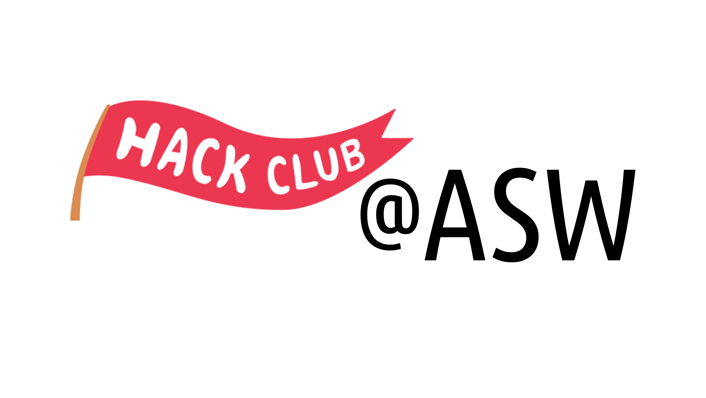

    

---

We are working on a knowledgebase for people to be able to learn about various coding concepts and tools. Please feel free to open a PR with anything you want to change and it will be much appreciated!

## Simple:
- [Tags in HTML](guides/htmltags.html)
- [Installing Visual Studio Code](guides/installvscode.html)
- [Web Portfolio](guides/portfolio.html)

## Intermediate:
- [Basics of Git](guides/git_basics.html)
- [Basics of the Terminal](guides/basicsoftheterminal.html)
- [Boba Drops Resources](guides/bobadrops.html)

## Advanced:
- [Bash Scripting](guides/bashscripting.html)

## Machine Learning:
- [Linear Regression](guides/ml-linearregression.html)

---

    ⭐ Favourite this repo

---

For more articles, email:
- [contact@silverflag.org](mailto:contact@silverflag.org)
- [sysadmin@silverflag](mailto:sysadmin@silverflag.org)
